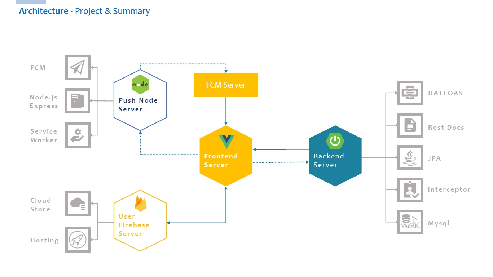
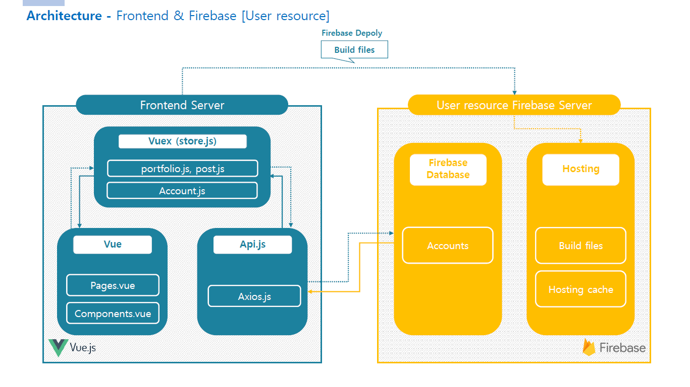
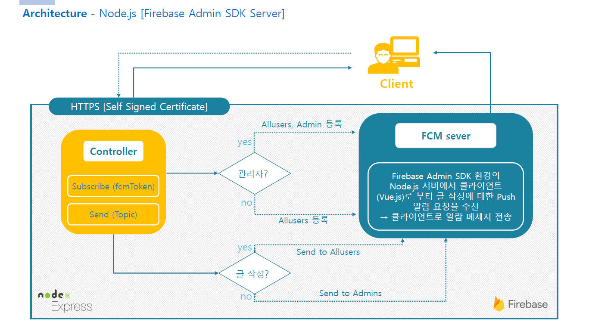
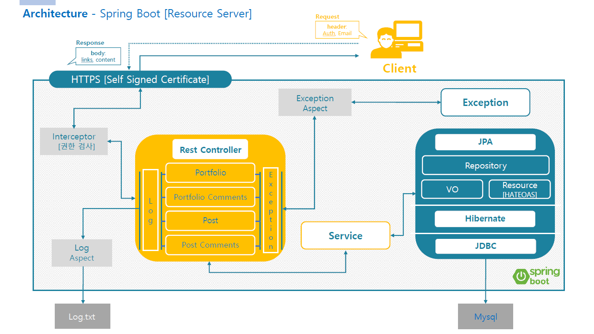
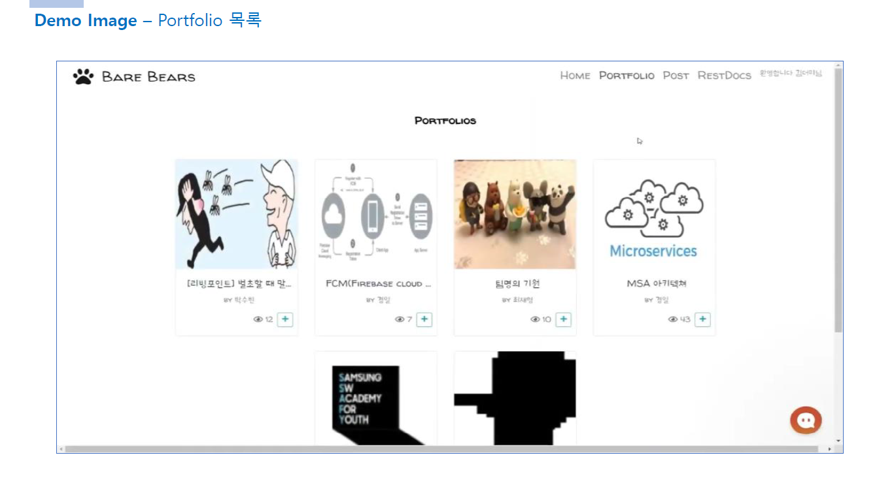
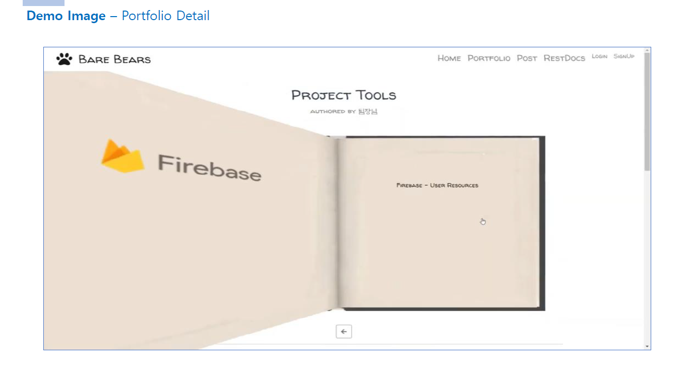
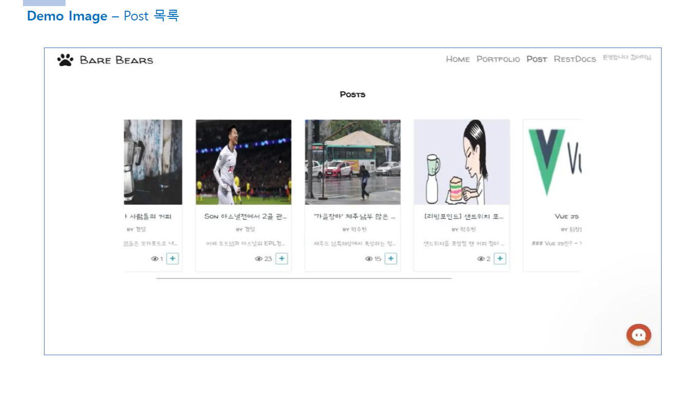
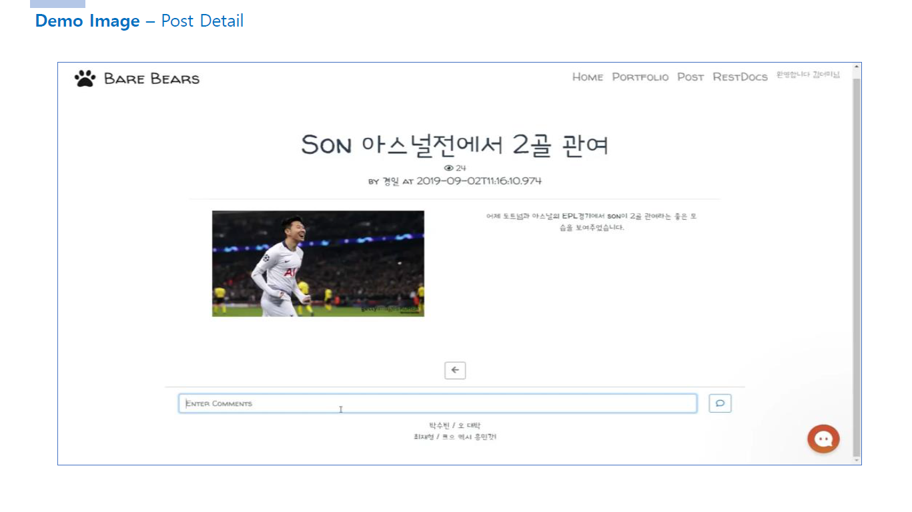

## [Bare Bears] Responsive Blog Web Service

- Deploy  : https://ssafy-barebears.firebaseapp.com/
  
  **※ But Only Front-end**
  
- Rest API Docs : https://ssafy-barebears.firebaseapp.com/restdocs.html

- Demo Video Link : https://www.youtube.com/watch?v=QdFMwUeUesQ&feature=youtu.be

 

---

## License
